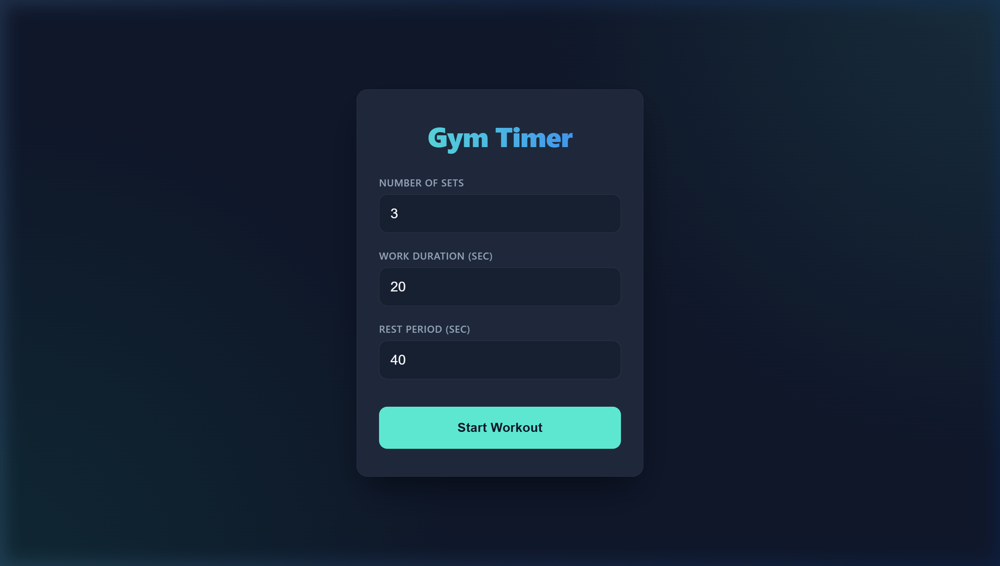

# Gym Interval Timer

A premium React web application designed for gym-goers to keep track of their workouts with customizable timing and real-time Voice synthesis.

## Features

- **Customizable Intervals:** Set the number of sets, work duration, and rest periods.
- **Voice Synthesis:** The application utilizes the native browser Text-to-Speech API to announce:
  - 5-second preparation count-downs.
  - Periodic 5-second interval notifications during your work phase.
  - Audible announcements of rest periods and workout completion.
- **Voice Selection:** Pick from the highest-quality Text-to-Speech voices available on your local operating system (such as Microsoft Zira, Google UK English).
- **Premium UI:** Features a sleek dark-mode glassmorphism interface with subtle pulse animations.

## Local Development

1. Clone the repository.
2. Run `npm install`
3. Run `npm run dev` to start the local development server using Vite.

## Architecture

- **Framework:** React + Vite
- **Styling:** Vanilla CSS 
- **Core APIs:** `window.speechSynthesis`
